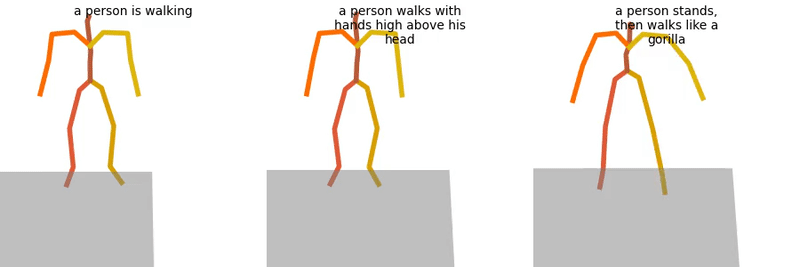
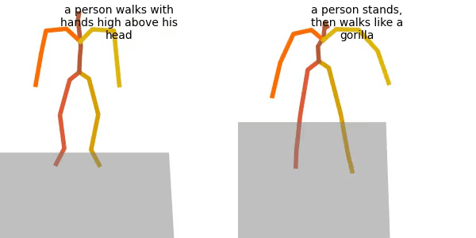

# Monkey See, Monkey Do: Harnessing Self-attention in Motion Diffusion for Zero-shot Motion Transfer

Please visit our [project page](https://monkeyseedocg.github.io/) for more details.

## Preparations
### Create Environment

This code has been tested in the following environment:
* Ubuntu 20.04.6 LTS
* Python 3.8
* conda3 or miniconda3
* CUDA capable GPU (one is enough) 

Setup conda env:
```shell
conda env create -f environment.yml
conda activate MoMo
pip install git+https://github.com/openai/CLIP.git
```

## Preparations

### Get Data

Data should be located in the `./dataset` folder.

We use the **HumanML3D** dataset. If you are only doing inference, a lightweight version is sufficient. The lightweight version saves disk space and is quicker to get.

#### Lightweight Version
Clone HumanML3D, then link the data folder to our repository:

```shell
cd ..
git clone https://github.com/EricGuo5513/HumanML3D.git
unzip ./HumanML3D/HumanML3D/texts.zip -d ./HumanML3D/HumanML3D
ln -s ../../HumanML3D/HumanML3D dataset/HumanML3D  # adjust "../../" if needed
```

#### Full Version
Follow the instructions in [HumanML3D](https://github.com/EricGuo5513/HumanML3D.git), then link the result folder to our repository:
```shell
ln -s ../../HumanML3D/HumanML3D dataset/HumanML3D  # adjust "../../" if needed
```

## Motion Transfer
### Download a pretrained model

Download the pretrained model using the script below. The model will be saved in the ./save/ directory.
```shell
bash prepare/download_model.sh
```

### Apply motion transfer

To generate motions using a pretrained model use the following command: 
```shell
python -m sample.transfer --model_path ./save/official_model/model000500000.pt --text_leader "a person is walking" --text_follower "a person walks with hands high above his head"  "a person stands, then walks like a gorilla" --num_repetitions 1 --assign_root_rot 
```
If you want to use real motions via inversion, make sure you have the **full version** of the dataset and use the following arguments:
```shell
--leader_motion_path dataset/HumanML3D/new_joint_vecs/006473.npy --follower_motion_path dataset/HumanML3D/new_joint_vecs/013122.npy    
```
Argument values are given as examples.

Where 
* `--text_leader`: the text controlling the generation of the leader motion.
* `--text_follower`: the text controlling the generation of the appearnce motions (one or more). The number of generated follower motions will match the number of given text controls.
* `--leader_motion_path`: a path to a motion to be used as a leader. 
  Overrides `--text_leader` if both are given.
* `--leader_motion_path`: paths to a motions to be used as followers (one or more). Overrides `--text_follower` if both are given.
* `--num_repetitions`: the number of instances of leader+followers to be generated. For each instance, a separte transfer is applied.

The rest of the arguments, and many others, can be found in `utils/sample_utils.py`.

Additional useful arguments: 
*  `--seed`: a seed for random generation.
*  `--device`: an index of a specific GPU to be used.
*  `--motion_length`: motion length in seconds. Network has trained on up to 9.8 seconds.

**Result files:**
* `results.npy` file with xyz positions of the generated animation
* `transfer_samples_00_to_##.mp4` - stick figure animations of all leader and output motions. The leftmost motion is the leader, followed by the output transferred results on its right. Each row represents a different repetition.
* `follower_samples_00_to_##.mp4` - stick figure animations of all follower motions. Each row represents a different repetition.

Example of file `transfer_samples_00_to_##.mp4`:



Example of file `follower_samples_00_to_##.mp4`:



## Other Functionalities
The following MDM functionalities can be used as in the MDM repository.
### Motion Synthesis
Follow [these instructions](https://github.com/GuyTevet/motion-diffusion-model?tab=readme-ov-file#motion-synthesis) under the ``Text to Motion`` detail. For example:
```shell
python -m sample.generate --model_path ./save/official_model/model000500000.pt --num_repetitions 3 --text_prompt "a person is dancing wildly" --motion_length 8
```
